# Task Manager

Script Python theo dõi CPU/RAM, xếp hạng tiến trình và gửi cảnh báo lên Discord khi vượt ngưỡng (cấu hình qua `.env`). Tài liệu này mô tả cài đặt, chạy thường, **chạy nền khi khởi động Windows** và **gỡ chạy nền**.

---

## Mục lục

1. [Tính năng](#tính-năng)
2. [Chuẩn bị](#chuẩn-bị-máy-windows)
3. [Cài đặt nhanh](#cài-đặt-nhanh)
4. [Chạy tay để kiểm tra](#chạy-tay-để-kiểm-tra)
5. [Chạy nền Windows — hướng dẫn từng bước](#chạy-nền-windows--hướng-dẫn-từng-bước)
6. [Gỡ chạy nền — hướng dẫn từng bước](#gỡ-chạy-nền--hướng-dẫn-từng-bước)
7. [Cấu hình `.env` (tóm tắt)](#cấu-hình-env-tóm-tắt)
8. [Bảng ghi chú ảnh minh họa](#bảng-ghi-chú-ảnh-minh-họa)

---

## Tính năng

- Theo dõi CPU và RAM theo thời gian thực.
- Cảnh báo Discord khi vượt ngưỡng (bật/tắt và điều chỉnh trong `.env`).
- Ghi trạng thái mới nhất vào `task_output.txt`.
- Tự động chạy khi đăng nhập Windows (tùy chọn, qua Task Scheduler).

---

## Chuẩn bị (máy Windows)

- **Windows 10/11.**
- **Python** từ [python.org](https://www.python.org/downloads/) — khi cài nhớ **tích “Add python.exe to PATH”**.

> **Ghi chú ảnh:** Thư mục `docs/images/`, tên file `01-python-install-add-path.png` — màn hình trình cài Python, ô *Add python.exe to PATH* đang được chọn.

---

## Cài đặt nhanh

Giả sử project nằm tại `D:\Desktop\Manager` (đổi đúng đường dẫn của bạn).

### Bước A — Mở terminal và vào thư mục project

1. Mở **Command Prompt** hoặc **PowerShell**.
2. Chạy:

```bat
cd /d D:\Desktop\Manager
```

> **Ghi chú ảnh:** `docs/images/02-terminal-cd-manager.png` — cửa sổ terminal sau lệnh `cd`, thấy đường dẫn `Manager`.

### Bước B — Kiểm tra Python

```bat
python --version
where pythonw
```

Cần có phiên bản Python và đường dẫn `pythonw.exe` (dùng cho chạy nền không cửa sổ).

> **Ghi chú ảnh:** `docs/images/03-python-version-where-pythonw.png` — kết quả hai lệnh trên.

### Bước C — (Tùy chọn) Virtual environment

```bat
python -m venv venv
venv\Scripts\activate
```

### Bước D — Cài thư viện

```bat
python -m pip install -r requirements.txt
```

(`requirements.txt` gồm `psutil`, `requests`.)

> **Ghi chú ảnh:** `docs/images/04-pip-install-requirements.png` — pip báo *Successfully installed*.

### Bước E — File `.env`

1. Copy `.env.example` thành `.env` trong **cùng thư mục** với `Task_Manager.py`.
2. Mở `.env`, điền webhook Discord và chỉnh tham số (xem mục [Cấu hình `.env`](#cấu-hình-env-tóm-tắt)).

> **Ghi chú ảnh:** `docs/images/05-env-file-in-folder.png` — Explorer hiện `Task_Manager.py`, `.env`, `.env.example` cùng cấp.

---

## Chạy tay để kiểm tra

Trong thư mục project (đã `cd`):

```bat
python Task_Manager.py
```

Bạn sẽ thấy log CPU/RAM trên terminal. **Ctrl+C** để dừng.

> **Ghi chú ảnh:** `docs/images/06-run-python-task-manager.png` — terminal đang in dòng trạng thái CPU/RAM.

Nếu lỗi thiếu module, chạy lại `pip install -r requirements.txt`. Nếu lỗi webhook, kiểm tra `.env`.

---

## Chạy nền Windows — hướng dẫn từng bước

Mục tiêu: **không cửa sổ đen**, vẫn đọc `.env` đúng chỗ, và **tự chạy mỗi lần đăng nhập Windows**.

### Phần 1 — Thử chạy nền một lần (chưa gắn khởi động)

1. Mở **File Explorer**, vào thư mục project (`D:\Desktop\Manager`).
2. **Double-click** file **`run_background.bat`**.

   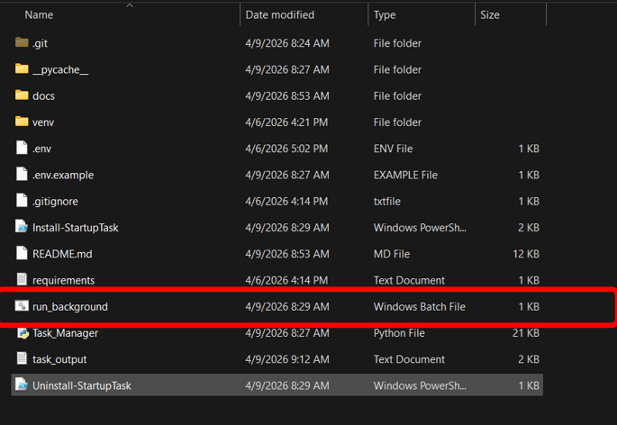

3. Cửa sổ có thể nháy rồi tắt — đó là bình thường (dùng `pythonw`).
4. Mở **`task_output.txt`** trong cùng thư mục: nếu thời gian / nội dung cập nhật thì script đang chạy nền.

   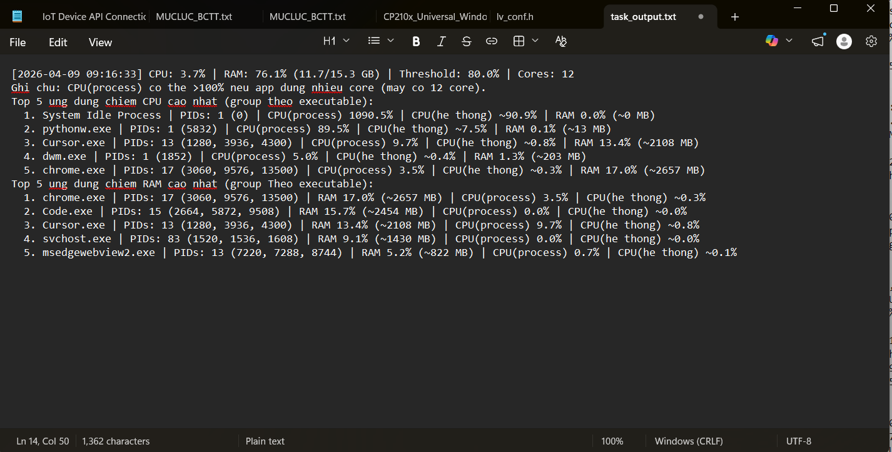

5. **Dừng** bản chạy thử: mở **Task Manager** (Ctrl+Shift+Esc) → tab **Processes** → tìm **Python** hoặc **pythonw** → **End task**.

   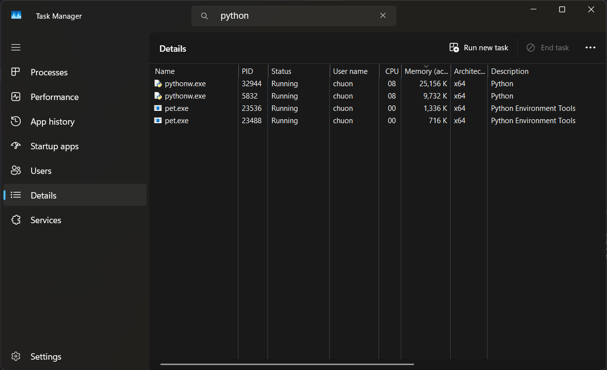

### Phần 2 — Đăng ký chạy tự động khi đăng nhập (Task Scheduler)

1. Trong Explorer, tại thư mục project, tìm file **`Install-StartupTask.ps1`**.
2. **Click phải** → **Run with PowerShell**.

   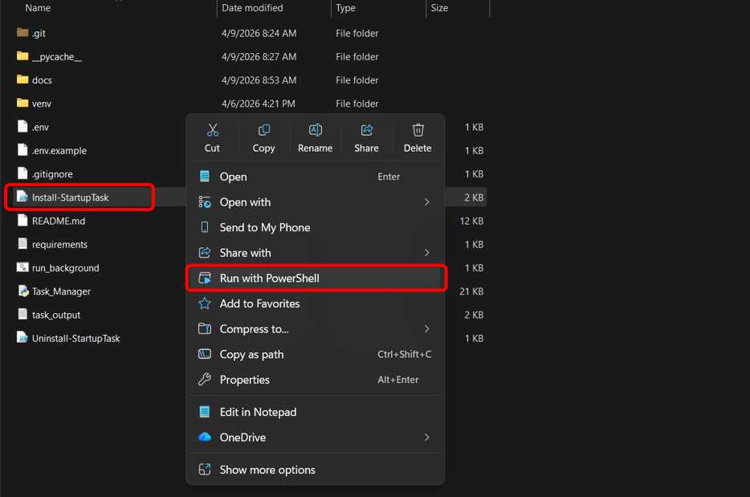

3. Nếu báo **execution policy** (không cho chạy script):

   - Mở **PowerShell** (tìm “Windows PowerShell” trong Start).
   - Chạy:

```powershell
Set-ExecutionPolicy -Scope CurrentUser -ExecutionPolicy RemoteSigned
```

   - Xác nhận **Y** nếu được hỏi.
   - Quay lại bước 2, hoặc chạy tay:

```powershell
cd D:\Desktop\Manager
powershell -ExecutionPolicy Bypass -File ".\Install-StartupTask.ps1"
```

   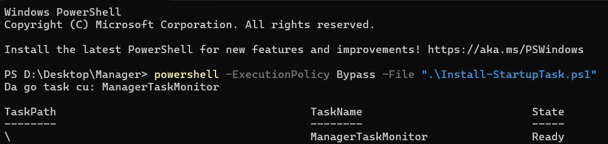

4. Khi thành công, cửa sổ in dòng kiểu: **`OK: Task 'ManagerTaskMonitor' se chay khi ban dang nhap Windows.`**

   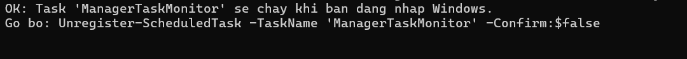

### Phần 3 — Kiểm tra trong Task Scheduler

1. Nhấn **Win + R**, gõ **`taskschd.msc`**, Enter.
2. Cây bên trái: **Task Scheduler Library**.
3. Tìm task tên **`ManagerTaskMonitor`**, trạng thái **Ready**.

   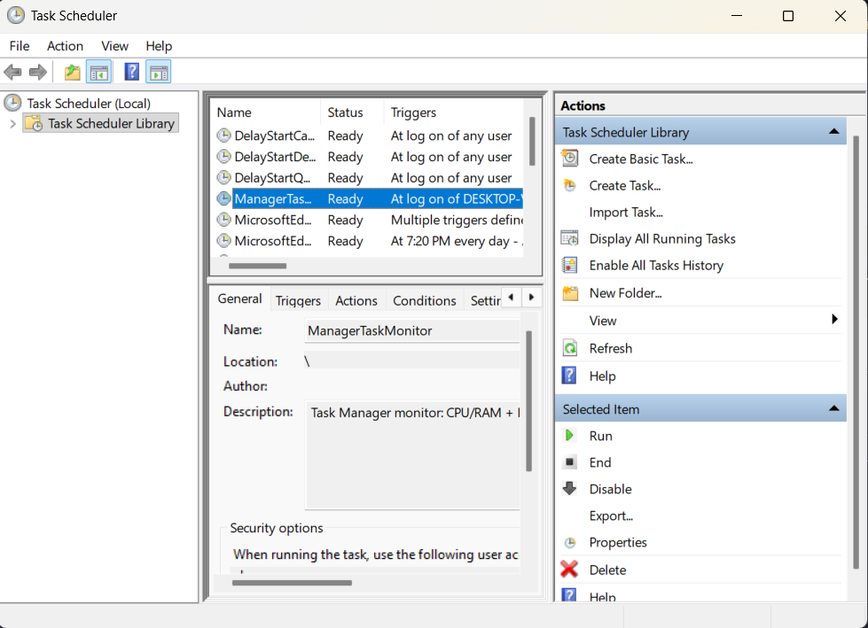

   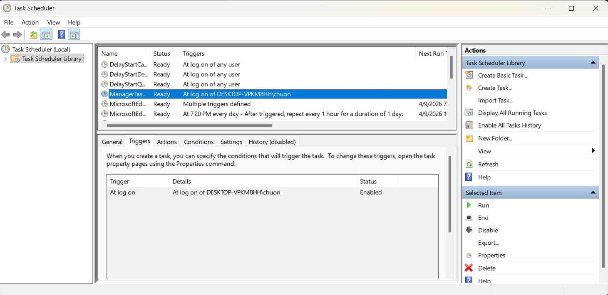

4. Khởi động lại máy hoặc **Sign out** rồi đăng nhập lại; kiểm tra `task_output.txt` có cập nhật.

---

## Gỡ chạy nền — hướng dẫn từng bước

### Cách 1 — Script gỡ (khuyên dùng)

1. Trong Explorer, **click phải** **`Uninstall-StartupTask.ps1`** → **Run with PowerShell**.
2. Thấy thông báo đã gỡ **`ManagerTaskMonitor`** là xong.

   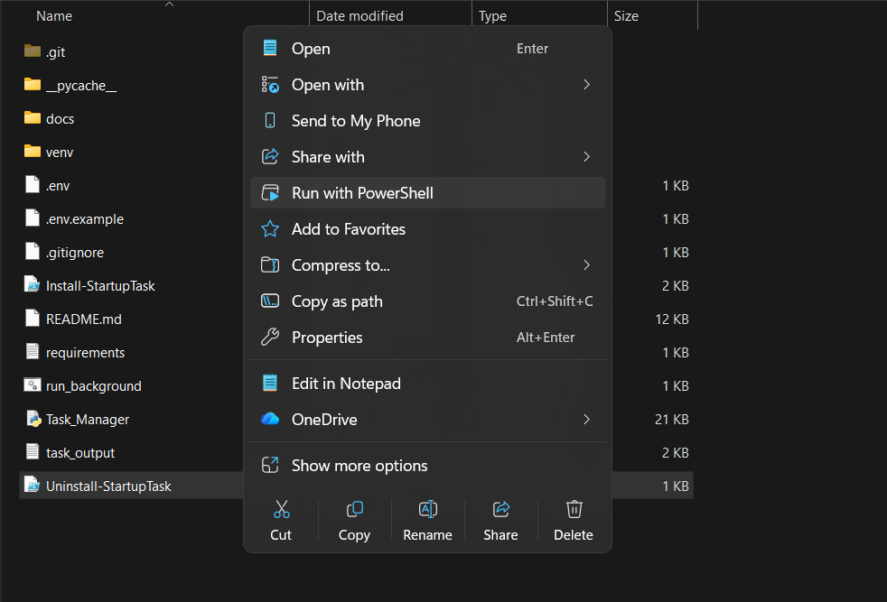

### Cách 2 — Gõ lệnh trong PowerShell

```powershell
Unregister-ScheduledTask -TaskName 'ManagerTaskMonitor' -Confirm:$false
```

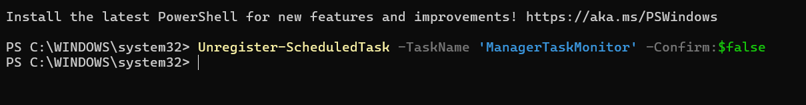

### Cách 3 — Gỡ bằng giao diện Task Scheduler

1. **Win + R** → `taskschd.msc`.
2. **Task Scheduler Library** → chọn **`ManagerTaskMonitor`**.
3. Panel bên phải: **Delete** → xác nhận.

   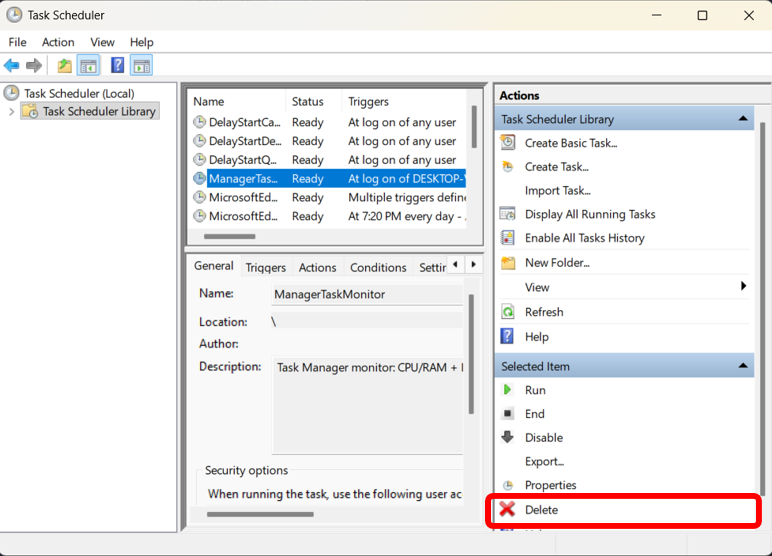

### Dừng process đang chạy (không xóa lịch)

Nếu chỉ muốn **tắt ngay** mà vẫn giữ task khởi động: mở **Task Manager** → End task **pythonw** như phần thử nền ở trên.

---

## Cấu hình `.env` (tóm tắt)

Xem đầy đủ trong `.env.example`. Một số biến thường dùng:

| Biến | Ý nghĩa |
|------|--------|
| `DISCORD_WEBHOOK_URL` | URL webhook (hoặc dùng ID + token như trong `.env.example`) |
| `REPORT_THRESHOLD_PERCENT` | Ngưỡng dùng chung (%), áp cho cả CPU và RAM nếu không khai báo riêng |
| `REPORT_THRESHOLD_CPU_PERCENT` | Ngưỡng % CPU (tùy chọn; mặc định = giá trị chung) |
| `REPORT_THRESHOLD_RAM_PERCENT` | Ngưỡng % RAM (tùy chọn; mặc định = giá trị chung) |
| `TOP_REPORT_PROCESS_COUNT` | Số dòng top CPU/RAM trong log / Discord |
| `CHECK_INTERVAL_SECONDS` | Nghỉ bao lâu (giây) giữa các vòng đo |
| `ENABLE_DISCORD_ALERT` | `true` / `false` |
| `ALERT_MODE` | `smart` hoặc `always` |
| `ALERT_COOLDOWN_SECONDS` | Khoảng cách tối thiểu giữa hai lần gửi Discord (chế độ smart) |

---

## Bảng ghi chú ảnh minh họa

- **Ảnh 7–17:** đã nhúng trực tiếp trong các mục [Chạy nền Windows](#chạy-nền-windows--hướng-dẫn-từng-bước) và [Gỡ chạy nền](#gỡ-chạy-nền--hướng-dẫn-từng-bước), lưu tại `docs/images/`.
- **Ảnh 1–6 (tùy chọn):** có thể bổ sung sau; khi đủ file, thêm vào README cùng cách ``.

| STT | File trong `docs/images/` | Ghi chú |
|-----|---------------------------|--------|
| 1 | `01-python-install-add-path.png` | Tùy chọn — trình cài Python, Add to PATH |
| 2 | `02-terminal-cd-manager.png` | Tùy chọn — terminal sau `cd` |
| 3 | `03-python-version-where-pythonw.png` | Tùy chọn — `python --version`, `where pythonw` |
| 4 | `04-pip-install-requirements.png` | Tùy chọn — pip cài xong |
| 5 | `05-env-file-in-folder.png` | Tùy chọn — `.env` cùng thư mục script |
| 6 | `06-run-python-task-manager.png` | Tùy chọn — chạy `python Task_Manager.py` |
| 7 | `07-double-click-run-background-bat.png` | Đã nhúng — `run_background.bat` |
| 8 | `08-task-output-after-background-run.png` | Đã nhúng — `task_output.txt` |
| 9 | `09-task-manager-end-pythonw.png` | Đã nhúng — Task Manager |
| 10 | `10-right-click-install-ps1-run-with-powershell.png` | Đã nhúng — Install script |
| 11 | `11-set-execution-policy-remotesigned.png` | Đã nhúng — ExecutionPolicy |
| 12 | `12-install-startup-script-success.png` | Đã nhúng — đăng ký OK |
| 13 | `13-task-scheduler-library.png` | Đã nhúng — Task Scheduler |
| 14 | `14-manager-task-monitor-selected.png` | Đã nhúng — task + Triggers |
| 15 | `15-uninstall-startup-ps1-success.png` | Đã nhúng — gỡ bằng script |
| 16 | `16-unregister-scheduled-task-powershell.png` | Đã nhúng — Unregister lệnh |
| 17 | `17-task-scheduler-delete-task.png` | Đã nhúng — Delete trong GUI |

---

## Xử lý sự cố nhanh

- **Không gửi được Discord:** kiểm tra webhook trong `.env`, `ENABLE_DISCORD_ALERT=true`.
- **Chạy nền mà không thấy gì:** bình thường; xem `task_output.txt` hoặc tạm chạy `python Task_Manager.py` để xem lỗi.
- **Task không chạy sau đăng nhập:** mở Task Scheduler → xem **Last Run Result** của `ManagerTaskMonitor`; kiểm tra Python vẫn trong PATH và đường dẫn project đúng (script đăng ký dùng thư mục chứa `Install-StartupTask.ps1` làm working directory).

---

## Chạy thủ công (Linux / macOS)

```bash
python3 -m venv venv
source venv/bin/activate   # Linux/macOS
pip install -r requirements.txt
cp .env.example .env
python Task_Manager.py
```

Hướng dẫn **chạy nềm + Task Scheduler** trong README này chỉ áp dụng cho **Windows**.
